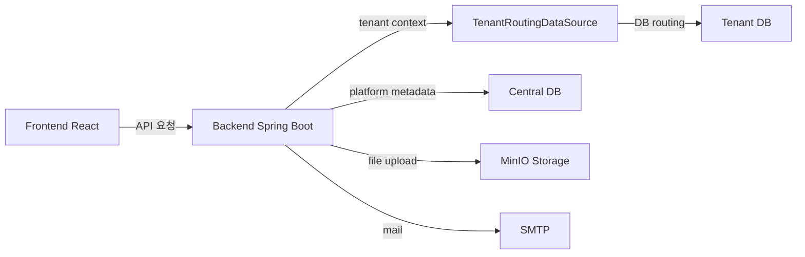

# 04. 프로젝트 구조 정리

## 1. 전체 구조

이 프로젝트는 크게 두 영역으로 나뉩니다.

- `backend/`: Spring Boot 기반 서버 코드
- `frontend/`: React + Vite 기반 사용자 화면
- `backend/DATABASE/`: PostgreSQL 초기화, bootstrap, 마이그레이션 SQL
- `docs/`: 문서/설계 보관
- `인수인계/`: 인수인계 문서

---

## 2. 백엔드 구조

주요 경로:

- `backend/src/main/java/`: Java 메인 소스
- `backend/src/main/resources/`: 설정 파일, SQL, mapper, static 자원
- `backend/pom.xml`: Maven 빌드 설정
- `backend/DATABASE/`: DB 생성 및 마이그레이션 스크립트

### 핵심 역할

- 로그인/인증 처리
- JWT 기반 권한 검증
- 테넌트 메타 관리
- 테넌트 DB routing
- 사용자/부서/메뉴/권한 관리
- 전자결재, 문서 첨부, 템플릿 관리
- 신규 테넌트 생성 및 DB 프로비저닝

### 백엔드에서 중요한 설계 포인트

- 중앙 DB와 테넌트 DB를 분리 운영
- 요청별로 `TenantContextHolder`와 `TenantRoutingDataSource`가 현재 tenant DB를 결정
- 신규 테넌트 생성 시 `PlatformTenantServiceImpl`와 `TenantDatabaseProvisioningServiceImpl`이 연결되어 동작
- 운영 환경 설정은 `application-dev.properties`, `application-prod.properties`에서 관리

---

## 3. 프론트엔드 구조

주요 경로:

- `frontend/src/`: 화면 및 애플리케이션 로직
- `frontend/public/`: 정적 파일
- `frontend/src/pages/`: 페이지별 화면
- `frontend/src/services/`: 백엔드 API 호출
- `frontend/src/shared/`: 공통 컴포넌트, 유틸
- `frontend/src/mocks/`: MSW mock 데이터

### 핵심 역할

- 사용자 로그인 화면 및 인증 흐름
- 테넌트별 페이지 라우팅
- 메뉴/권한 기반 화면 제어
- API 호출 및 응답 처리
- 운영/관리 화면 렌더링

### 프론트엔드에서 주의할 점

- 실제 인증은 백엔드 JWT 검증에 의존
- tenant context는 서버에서 추적하므로 프론트는 보통 토큰과 API 호출 중심으로 동작
- 특정 화면 접근 제어는 서버의 메뉴/권한 데이터와 연동됨

---

## 4. 시스템 간 연결 구조

---

## 5. 운영 관점에서의 역할

- 백엔드는 시스템의 실제 업무 처리와 DB 연결의 중심
- 프론트엔드는 사용자 인터페이스와 요청 전달 담당
- 중앙 DB는 도메인/권한/테넌트 공통 관리
- 테넌트 DB는 업무용 데이터 관리

이 구조를 이해하면 신규 테넌트 등록, 로그인, 권한 처리, DB 라우팅 흐름을 쉽게 이해할 수 있습니다.
