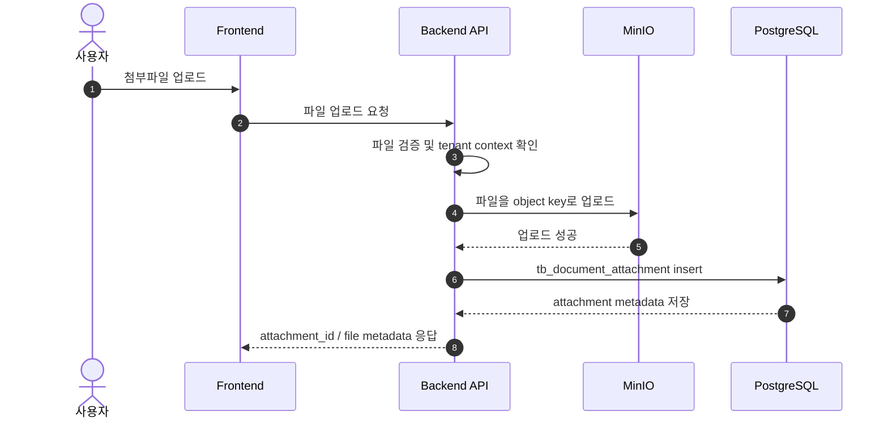
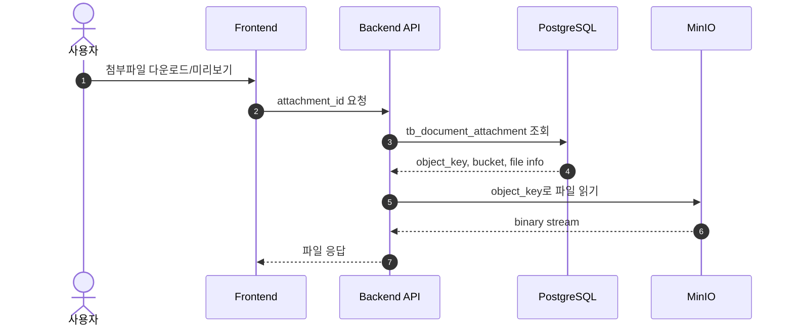

# 05. 첨부파일 / MinIO 연동 정리

## 1. 개요

이 프로젝트는 첨부파일을 로컬 파일 시스템이 아니라 MinIO 스토리지에 저장하는 구조를 사용합니다.

중요 포인트:

- 실제 파일은 MinIO 버킷에 저장
- DB에는 파일 메타데이터만 저장
- `tb_document_attachment` 테이블이 파일 등록 정보의 기준
- 첨부 파일 업로드/조회/삭제는 객체 저장소와 DB 메타를 함께 처리

---

## 2. 설정값

운영 환경에서 MinIO 관련 설정은 보통 아래 형태로 관리됩니다.

- `storage.provider=minio`
- `storage.endpoint=<내부 MinIO 엔드포인트>`
- `storage.bucket=<첨부 버킷명>`
- `storage.accessKey=<설정된 access key>`
- `storage.secretKey=<비밀 키>`
- `storage.region=<리전>`
- `storage.presignExpirySeconds=<유효시간>`

> 실제 서버 주소, 포트, 키 값은 문서에 적지 않고 운영 보안 저장소에서 관리하는 것을 권장합니다.

관련 문서:

- [03-operational-config.md](03-operational-config.md)

---

## 3. 데이터베이스 메타 구조

첨부파일 테이블은 보통 다음과 같은 정보를 저장합니다.

### tb_document_attachment

| 컬럼               | 설명                    |
| ------------------ | ----------------------- |
| attachment_id      | PK                      |
| tenant_id          | 테넌트 ID               |
| approval_id        | 결재 문서 FK            |
| object_key         | MinIO에 저장된 객체 key |
| original_file_name | 원본 파일명             |
| file_ext           | 확장자                  |
| content_type       | MIME 타입               |
| file_size          | 파일 크기               |
| checksum_sha256    | 파일 해시               |
| storage_provider   | 저장소 종류 (MinIO)     |
| bucket_name        | 버킷명                  |
| upload_status      | 업로드 상태             |
| previewable_yn     | 미리보기 가능 여부      |
| deleted_yn         | 삭제 여부               |
| created_by         | 생성자                  |
| created_at         | 생성 일시               |
| updated_by         | 수정자                  |
| updated_at         | 수정 일시               |

핵심 의미:

- 실제 파일은 MinIO에 저장
- DB는 파일 위치와 메타 정보를 보관
- 결재 문서/문서 작업과 연결해 조회 가능

---

## 4. 업로드 흐름

### 처리 순서

1. 사용자 요청이 들어옴
2. 백엔드에서 tenant 정보와 파일명을 검증
3. object key 생성
4. MinIO에 파일 저장
5. DB에 메타 저장
6. 클라이언트에 첨부 ID와 메타 응답

---

## 5. 다운로드 / 조회 흐름

### 조회되는 값

- `object_key`
- `bucket_name`
- `original_file_name`
- `content_type`
- `file_size`
- `previewable_yn`

이 값으로 MinIO에서 실제 객체를 가져오고, 브라우저 또는 서버에서 다운로드/미리보기 처리를 수행합니다.

---

## 6. 삭제 흐름

첨부 삭제는 보통 다음 두 단계로 처리합니다.

1. DB에서 해당 row를 논리 삭제 처리
   - `deleted_yn = Y`
   - `upload_status = DELETED`
2. MinIO에서 실제 object 삭제

실무상 구현 방식은 아래와 같은 조합이 많습니다.

- 논리 삭제 먼저 수행
- object 제거 시도
- 실패 시 별도 로그나 보관 정책 적용

---

## 7. MinIO 운영 포인트

### 7-1. 버킷 설계

- 기본적으로 tenant 단위 또는 기능 단위로 버킷을 나누는 구조를 고려할 수 있음
- 현재 문서상에서는 `document-attachments` 버킷을 중심으로 동작하는 것으로 보임

### 7-2. 파일 키 정책

보통 아래와 같은 패턴을 사용합니다.

- `tenant/{tenantId}/approval/{approvalId}/{uuid}-{originalName}`
- `tenant/{tenantId}/document/{attachmentId}/{fileName}`

이렇게 하면 같은 이름의 파일이 충돌하지 않고, 권한 범위와 사용처를 구분하기 쉽습니다.

### 7-3. 보안 포인트

- MinIO accessKey / secretKey는 환경 변수로 관리
- public 접근을 허용하지 않고, presigned URL 또는 서버 검증 기반으로 제한하는 게 안전
- 업로드/다운로드 시 `tenant_id`와 `approval_id` 기반 권한 확인이 필요

---

## 8. 실제 운영에서 중요

1. DB 메타와 MinIO 오브젝트가 일치해야 함
2. `object_key`가 잘못되면 파일이 조회되지 않음
3. `deleted_yn` 값과 실제 MinIO object 상태가 어긋나면 운영 문제 발생 가능
4. 파일 해시(`checksum_sha256`)는 중복 업로드/무결성 체크에 중요
5. 업로드/다운로드 시 tenant context가 제대로 유지되어야 서로 다른 테넌트 파일이 섞이지 않음

---

## 9. 요약

이 프로젝트의 첨부파일 구조는 "DB에는 메타 데이터, MinIO에는 실제 파일"이라는 표준적인 객체 스토리지 패턴입니다.

핵심은 다음 3가지입니다.

- `tb_document_attachment` 저장 메타
- MinIO object_key 기반 실제 파일 저장
- tenant/approval 기준 접근 제어와 감사 로그

첨부 기능을 운영하거나 디버깅할 때는, 파일 경로와 메타 row를 함께 확인해야 합니다.
