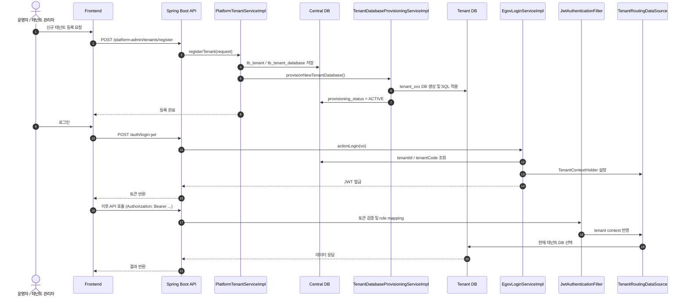

# HACCP Cloud 인수인계 문서

## 문서 구조

- [01. DB 스키마 상세 정리](01-db-schema.md)
- [02. 신규 테넌트 생성 절차](02-new-tenant-procedure.md)
- [03. 운영 배포 변수 정리](03-operational-config.md)

## 1. 프로젝트 개요

이 프로젝트는 PostgreSQL 기반 멀티테넌트 구조를 가진 HACCP Cloud 서비스입니다.

- 중앙 DB: `haccp_cloud_central`
- 테넌트 DB: `tenant_XXXXXXX` 형식
- 백엔드: Spring Boot
- 프론트엔드: React + Vite
- 인증: JWT + Spring Security
- 저장소: MinIO

## 2. 핵심 운영 포인트

1. 중앙 DB는 플랫폼 메타데이터, 테넌트 정보, 권한, 메뉴, 플랜, 구독 정보를 관리합니다.
2. 테넌트 DB는 실제 업무 데이터와 전자결재/문서 데이터를 저장합니다.
3. 요청 시 `TenantContextFilter`와 `TenantRoutingDataSource`가 현재 테넌트 DB를 결정합니다.
4. 신규 테넌트 생성은 DB 생성, 권한 세팅, 구독 등록, 온보딩 발송까지 한 번에 처리됩니다.
5. 운영 환경 배포는 DB, JWT, MinIO, 이메일, SSO 관련 환경 변수를 정합하게 맞춰야 합니다.

## 3. 바로 확인할 문서

- 테이블/컬럼 중심 스키마: [01-db-schema.md](01-db-schema.md)
- 신규 테넌트 생성 절차: [02-new-tenant-procedure.md](02-new-tenant-procedure.md)
- 운영 배포 및 환경 변수: [03-operational-config.md](03-operational-config.md)
- 첨부파일/MinIO 저장 구조: [05-attachment-minio.md](05-attachment-minio.md)

## 4. 프로젝트 구조

### 4-1. 문서 역할 분리

- [01-db-schema.md](01-db-schema.md): DB 구조와 핵심 테이블/컬럼 정리
- [02-new-tenant-procedure.md](02-new-tenant-procedure.md): 테넌트 생성 절차와 프로비저닝 흐름
- [03-operational-config.md](03-operational-config.md): 운영 환경 변수와 배포 설정 정리
- [04-project-structure.md](04-project-structure.md): 프론트엔드/백엔드 구조와 모듈 역할

### 4-2. 전체 시스템 요약

- 중앙 DB: 플랫폼 메타데이터, 권한, 테넌트 정보, 플랜/구독 관리
- 테넌트 DB: 실제 업무 데이터와 전자결재/문서 데이터 저장
- 백엔드: Spring Boot, JWT, PostgreSQL, tenant routing, provisioning
- 프론트엔드: React + Vite, 화면/라우팅, API 호출

### 4-3. 빠른 이해 포인트

- 테넌트는 메타 DB에서 관리되고, 업무 데이터는 tenant DB에서 분리 저장됩니다.
- 로그인 시 `TenantContextHolder`와 `TenantRoutingDataSource`가 사용자 요청의 DB를 결정합니다.
- 신규 테넌트는 DB 생성, 기본 메뉴/권한 세팅, 구독 생성, 온보딩 메일 발송까지 연계됩니다.

## 5. 테넌트 생성 / 로그인 다이어그램

---

## 6. 실무 요약

- 중앙 DB와 테넌트 DB를 분리 운영하는 구조입니다.
- 새 테넌트 생성은 메타 생성 + 실제 DB 생성 + 권한/구독 초기화 + 온보딩을 포함합니다.
- 로그인/권한은 JWT와 `TenantContextHolder` 기반으로 동작합니다.
- 운영 환경은 DB, JWT secret, storage, 메일, SSO 설정이 중요합니다.

### 문서별 빠른 이동

- [01-db-schema.md](01-db-schema.md): 스키마와 컬럼 이해
- [02-new-tenant-procedure.md](02-new-tenant-procedure.md): 신규 테넌트 생성 절차
- [03-operational-config.md](03-operational-config.md): 운영 환경 설정
- [04-project-structure.md](04-project-structure.md): 프론트/백엔드 구조
- [05-attachment-minio.md](05-attachment-minio.md): 첨부파일과 MinIO 저장 구조
