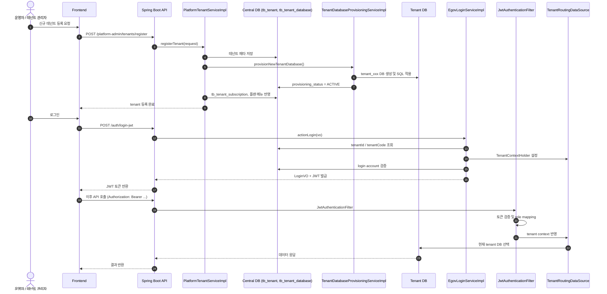
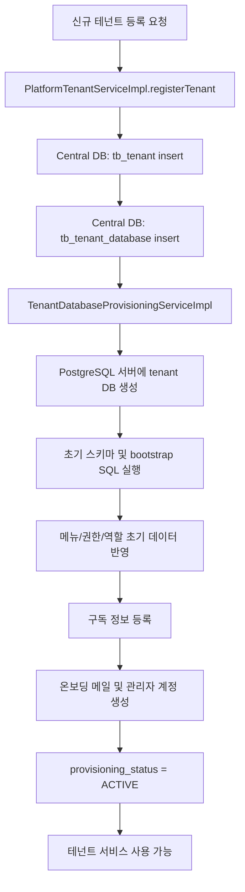

# HACCP Cloud 인수인계 문서

## 문서 구조

- [01. DB 스키마 상세 정리](01-db-schema.md)
- [02. 신규 테넌트 생성 절차](02-new-tenant-procedure.md)
- [03. 운영 배포 변수 정리](03-operational-config.md)

## 1. 프로젝트 개요

이 프로젝트는 PostgreSQL 기반 멀티테넌트 구조를 가진 HACCP Cloud 서비스입니다.

- 중앙 DB: `haccp_cloud_central`
- 테넌트 DB: `tenant_XXXXXXX` 형식
- 백엔드: Spring Boot
- 프론트엔드: React + Vite
- 인증: JWT + Spring Security
- 저장소: MinIO

## 2. 핵심 운영 포인트

1. 중앙 DB는 플랫폼 메타데이터, 테넌트 정보, 권한, 메뉴, 플랜, 구독 정보를 관리합니다.
2. 테넌트 DB는 실제 업무 데이터와 전자결재/문서 데이터를 저장합니다.
3. 요청 시 `TenantContextFilter`와 `TenantRoutingDataSource`가 현재 테넌트 DB를 결정합니다.
4. 신규 테넌트 생성은 DB 생성, 권한 세팅, 구독 등록, 온보딩 발송까지 한 번에 처리됩니다.
5. 운영 환경 배포는 DB, JWT, MinIO, 이메일, SSO 관련 환경 변수를 정합하게 맞춰야 합니다.

## 3. 바로 확인할 문서

- 테이블/컬럼 중심 스키마: [01-db-schema.md](01-db-schema.md)
- 신규 테넌트 생성 절차: [02-new-tenant-procedure.md](02-new-tenant-procedure.md)
- 운영 배포 및 환경 변수: [03-operational-config.md](03-operational-config.md)

## 4. 테넌트 생성 / 로그인 다이어그램

---

## 5. 실무 요약

이 프로젝트는 단순한 단일 DB 구조가 아니라, "중앙 메타DB + 테넌트별 업무DB" 구조를 갖는 멀티테넌트 시스템입니다. 운영 인수인계 시 가장 중요한 것은 다음입니다.

- 중앙 DB와 테넌트 DB의 역할 구분
- 신규 테넌트 생성 시 DB 생성 및 권한 초기화 절차
- 로그인/권한/도메인 기반 라우팅 흐름
- 배포 환경 변수와 보안 키 관리

## 6. 테넌트 DB 생성 프로세스 상세

다음은 신규 테넌트가 생성될 때 실제로 어떤 절차로 DB가 준비되는지 정리한 흐름입니다. 핵심 구현 포인트는 `PlatformTenantServiceImpl.registerTenant()`과 `TenantDatabaseProvisioningServiceImpl.provisionNewTenantDatabase()`입니다.

### 6-1. 절차 개요

1. 테넌트 등록 요청 수신
2. 중앙 DB에 테넌트 메타 저장
3. 테넌트용 DB 이름과 DB 키 생성
4. PostgreSQL 서버에 실제 tenant DB 생성
5. 초기 스키마 및 bootstrap SQL 실행
6. 플랜/메뉴/권한 초기 데이터 반영
7. 구독 정보 등록
8. 온보딩 이메일과 관리자 계정 생성
9. `provisioning_status = ACTIVE`로 전환

### 6-2. 단계별 상세

#### 1) 테넌트 등록 요청

- 운영자 또는 관리자 화면에서 신규 테넌트 생성 요청이 들어옵니다.
- API는 플랫폼 관리자 도메인에서 `registerTenant()`을 호출합니다.
- 이 단계에서 사업자번호, 법인번호, 이메일, 테넌트명, 업종 정보 등이 검증됩니다.

#### 2) 중앙 DB 메타 생성

- `tb_tenant`에 테넌트 기본 정보가 insert됩니다.
- `tb_tenant_database`에 아래 값이 저장됩니다.
  - `tenant_id`
  - `db_key`
  - `db_name`
  - `jdbc_url`
  - `jdbc_username`
  - `schema_name`
  - `provisioning_status`

이 시점에는 아직 실제 테넌트 DB는 생성되지 않은 상태입니다.

#### 3) 실제 tenant DB 생성

`TenantDatabaseProvisioningServiceImpl`가 다음 순서로 동작합니다.

- `postgres` 또는 기본 서버 DB에 연결
- `CREATE DATABASE "tenant_xxx"` 실행
- 새 DB로 연결
- `public` 스키마 또는 지정 스키마 생성
- 테넌트 초기 스키마 SQL 실행
- bootstrap SQL 실행
- 필요 시 마이그레이션 SQL 추가 적용

중요 SQL 파일 예시:

- `backend/DATABASE/create_postgresql_schema_active_tables.sql`
- `backend/DATABASE/bootstrap_postgresql_tenant.sql`
- `backend/DATABASE/migrate_postgresql_add_*.sql`

#### 4) 초기 데이터 반영

테넌트 DB가 만들어지면 다음 초기 데이터가 들어갑니다.

- 기본 메뉴(`tb_menu`)
- 역할(`tb_role`)
- 권한(`tb_permission`)
- 역할-메뉴-권한 매핑(`tb_role_menu_permission`)
- 플랜/구독 초기 값

이때 `plan_menu` 또는 `plan_code` 기반으로 어떤 메뉴가 허용되는지 설정됩니다.

#### 5) 구독 정보 연결

- `tb_tenant_subscription`에 구독 상태와 기간이 기록됩니다.
- 플랜 코드와 연결되어 최종 사용 가능 기능 범위가 결정됩니다.

#### 6) 온보딩 및 관리자 계정 생성

- 인증 링크/검증 메일 발송
- 관리자 계정 생성
- 초기 사용자/권한 매핑
- 로그인 준비 완료

### 6-3. DB 생성 흐름도

### 6-4. 운영상 주의점

- 실제 DB 생성 전/후에 `tb_tenant_database.provisioning_status`를 꼭 확인해야 합니다.
- tenant DB가 생성되지 않으면 로그인, 메뉴 로딩, 결재 기능이 모두 실패합니다.
- `TenantRoutingDataSource`는 이 메타 정보를 기반으로 라우팅하므로 DB 키와 DB 명의 매핑이 정확해야 합니다.
- 신규 테넌트는 단순 등록이 아니라 DB 프로비저닝 + 권한 초기화 + 온보딩이 함께 수행되는 구조입니다.

---

다음 단계로 추가 인수인계가 필요하면, 아래 항목도 이어서 정리할 수 있습니다.

- 주요 API 경로와 도메인별 역할
- 로그인/권한 흐름
- 배포/운영 환경 변수 정리
- 실제 테이블 컬럼 상세 정보
